# 💰 Budget Manager

Application desktop de gestion de budget personnel développée en **Java 17**, **JavaFX** et **PostgreSQL**.

Cette application permet aux utilisateurs de gérer leurs budgets, catégories, revenus et dépenses afin de suivre leur situation financière à travers un tableau de bord interactif.

---

# 🚀 Fonctionnalités

## 👤 Gestion des comptes

- Création de compte utilisateur
- Connexion sécurisée
- Gestion du profil utilisateur

## 💼 Gestion des budgets

- Création de plusieurs budgets
- Modification d'un budget
- Suppression d'un budget
- Gestion de la devise

## 📂 Gestion des catégories

- Création de catégories personnalisées
- Modification des catégories
- Suppression des catégories
- Association des catégories à un budget

## 💸 Gestion des transactions

- Ajout de revenus
- Ajout de dépenses
- Modification des transactions
- Suppression des transactions
- Recherche de transactions
- Filtrage par date

## 📊 Tableau de bord

- Total des revenus
- Total des dépenses
- Solde actuel
- Nombre total de transactions
- Répartition des dépenses par catégorie (Pie Chart)
- Évolution mensuelle des revenus et dépenses (Bar Chart)

---
## Mermaid 

```mermaid
flowchart TD

subgraph group_bootstrap["Bootstrap & module"]
  node_launcher(("Launcher<br/>entrypoint<br/>[Launcher.java]"))
  node_app["App"]
  node_module["Module info<br/>module boundary<br/>[module-info.java]"]
end

subgraph group_presentation["JavaFX UI"]
  node_mainctl["Main view<br/>ui shell"]
  node_nav["Navigation<br/>ui util"]
  node_session["Session<br/>auth state"]
  node_authctl["Auth screens<br/>controllers"]
  node_budgetctl["Budget screens<br/>controllers"]
  node_transctl["Transactions<br/>controllers"]
  node_dashctl["Dashboard<br/>analytics ui"]
end

subgraph group_domain["Domain model"]
  node_entities[("Entities<br/>domain model<br/>[Account.java]")]
end

subgraph group_service["Services"]
  node_acctsvc["Account svc"]
  node_budsvc["Budget svc"]
  node_catsvc["Category svc"]
  node_transsvc["Transaction svc"]
  node_dashsvc["Stats svc<br/>analytics service"]
  node_dup{{"Duplicate rule<br/>service error"}}
end

subgraph group_persistence["Persistence"]
  node_basedao["Base DAO<br/>jdbc base<br/>[BaseDAO.java]"]
  node_daos["DAOs<br/>data access"]
  node_dbconn["DB config<br/>jdbc setup"]
end

subgraph group_resources["Resources & schema"]
  node_fxml["FXML views<br/>ui resources<br/>[MainLayout.fxml]"]
  node_css["Styles<br/>ui resource<br/>[style.css]"]
  node_dbprops["DB props<br/>config resource"]
  node_schema[("Schema<br/>[budget_db.sql]")]
end

node_launcher -->|"starts"| node_app
node_app -->|"runs in"| node_module
node_app -->|"loads UI"| node_fxml
node_fxml -->|"binds"| node_mainctl
node_fxml -->|"binds"| node_authctl
node_fxml -->|"binds"| node_budgetctl
node_fxml -->|"binds"| node_transctl
node_fxml -->|"binds"| node_dashctl
node_mainctl -->|"navigates"| node_nav
node_authctl -->|"sets user"| node_session
node_budgetctl -->|"reads user"| node_session
node_transctl -->|"reads user"| node_session
node_dashctl -->|"reads user"| node_session
node_authctl -->|"calls"| node_acctsvc
node_budgetctl -->|"calls"| node_budsvc
node_budgetctl -->|"calls"| node_catsvc
node_transctl -->|"calls"| node_transsvc
node_dashctl -->|"calls"| node_dashsvc
node_acctsvc -->|"uses"| node_daos
node_budsvc -->|"uses"| node_daos
node_catsvc -->|"uses"| node_daos
node_transsvc -->|"uses"| node_daos
node_dashsvc -->|"reads"| node_daos
node_daos -->|"extends"| node_basedao
node_basedao -->|"connects"| node_dbconn
node_dbconn -->|"configures"| node_dbprops
node_dbconn -->|"targets"| node_schema
node_acctsvc -->|"raises"| node_dup
node_budsvc -->|"raises"| node_dup
node_catsvc -->|"raises"| node_dup
node_transsvc -->|"maps"| node_entities
node_acctsvc -->|"maps"| node_entities
node_budsvc -->|"maps"| node_entities
node_catsvc -->|"maps"| node_entities
node_dashsvc -->|"aggregates"| node_entities
node_css -->|"styles"| node_fxml

click node_launcher "https://github.com/yassinean/gestion_budget/blob/main/src/main/java/com/ba/budgetapp/Launcher.java"
click node_app "https://github.com/yassinean/gestion_budget/blob/main/src/main/java/com/ba/budgetapp/HelloApplication.java"
click node_module "https://github.com/yassinean/gestion_budget/blob/main/src/main/java/module-info.java"
click node_mainctl "https://github.com/yassinean/gestion_budget/blob/main/src/main/java/com/ba/budgetapp/controllers/MainController.java"
click node_nav "https://github.com/yassinean/gestion_budget/blob/main/src/main/java/com/ba/budgetapp/utils/NavigationUtil.java"
click node_session "https://github.com/yassinean/gestion_budget/blob/main/src/main/java/com/ba/budgetapp/utils/SessionManager.java"
click node_authctl "https://github.com/yassinean/gestion_budget/blob/main/src/main/java/com/ba/budgetapp/controllers/LoginController.java"
click node_budgetctl "https://github.com/yassinean/gestion_budget/blob/main/src/main/java/com/ba/budgetapp/controllers/BudgetController.java"
click node_transctl "https://github.com/yassinean/gestion_budget/blob/main/src/main/java/com/ba/budgetapp/controllers/TransactionController.java"
click node_dashctl "https://github.com/yassinean/gestion_budget/blob/main/src/main/java/com/ba/budgetapp/controllers/DashboardController.java"
click node_entities "https://github.com/yassinean/gestion_budget/blob/main/src/main/java/com/ba/budgetapp/models/entities/Account.java"
click node_acctsvc "https://github.com/yassinean/gestion_budget/blob/main/src/main/java/com/ba/budgetapp/services/Impl/AccountServiceImpl.java"
click node_budsvc "https://github.com/yassinean/gestion_budget/blob/main/src/main/java/com/ba/budgetapp/services/Impl/BudgetServiceImpl.java"
click node_catsvc "https://github.com/yassinean/gestion_budget/blob/main/src/main/java/com/ba/budgetapp/services/Impl/CategoryServiceImpl.java"
click node_transsvc "https://github.com/yassinean/gestion_budget/blob/main/src/main/java/com/ba/budgetapp/services/Impl/TransactionServiceImpl.java"
click node_dashsvc "https://github.com/yassinean/gestion_budget/blob/main/src/main/java/com/ba/budgetapp/services/Impl/DashboardServiceImpl.java"
click node_dup "https://github.com/yassinean/gestion_budget/blob/main/src/main/java/com/ba/budgetapp/services/Impl/DuplicateResourceException.java"
click node_basedao "https://github.com/yassinean/gestion_budget/blob/main/src/main/java/com/ba/budgetapp/models/DAO/BaseDAO.java"
click node_daos "https://github.com/yassinean/gestion_budget/blob/main/src/main/java/com/ba/budgetapp/models/DAO/Impl/AccountDAOImpl.java"
click node_dbconn "https://github.com/yassinean/gestion_budget/blob/main/src/main/java/com/ba/budgetapp/config/DatabaseConnection.java"
click node_fxml "https://github.com/yassinean/gestion_budget/blob/main/src/main/resources/com/ba/budgetapp/Views/MainLayout.fxml"
click node_css "https://github.com/yassinean/gestion_budget/blob/main/src/main/resources/com/ba/budgetapp/CSS/style.css"
click node_dbprops "https://github.com/yassinean/gestion_budget/blob/main/src/main/resources/database.properties"
click node_schema "https://github.com/yassinean/gestion_budget/blob/main/budget_db.sql"

classDef toneNeutral fill:#f8fafc,stroke:#334155,stroke-width:1.5px,color:#0f172a
classDef toneBlue fill:#dbeafe,stroke:#2563eb,stroke-width:1.5px,color:#172554
classDef toneAmber fill:#fef3c7,stroke:#d97706,stroke-width:1.5px,color:#78350f
classDef toneMint fill:#dcfce7,stroke:#16a34a,stroke-width:1.5px,color:#14532d
classDef toneRose fill:#ffe4e6,stroke:#e11d48,stroke-width:1.5px,color:#881337
classDef toneIndigo fill:#e0e7ff,stroke:#4f46e5,stroke-width:1.5px,color:#312e81
classDef toneTeal fill:#ccfbf1,stroke:#0f766e,stroke-width:1.5px,color:#134e4a
class node_launcher,node_app,node_module toneBlue
class node_mainctl,node_nav,node_session,node_authctl,node_budgetctl,node_transctl,node_dashctl toneAmber
class node_entities toneMint
class node_acctsvc,node_budsvc,node_catsvc,node_transsvc,node_dashsvc,node_dup toneRose
class node_basedao,node_daos,node_dbconn toneIndigo
class node_fxml,node_css,node_dbprops,node_schema toneTeal

```


# 🏗️ Architecture

Le projet suit une architecture en couches inspirée du modèle MVC.

```text
src/main/java
│
├── model
│   ├── Account
│   ├── Budget
│   ├── Category
│   └── Transaction
│
├── dao
│   ├── interfaces
│   └── implementations
│
├── service
│   ├── interfaces
│   └── implementations
│
├── controller
│
├── view
│   ├── fxml
│   └── css
│
├── util
│
└── config
